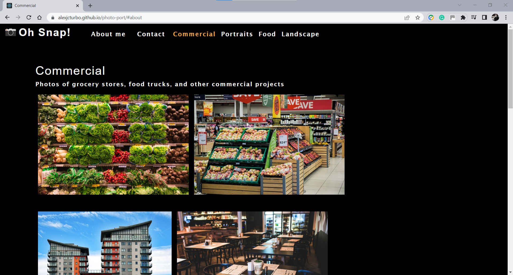
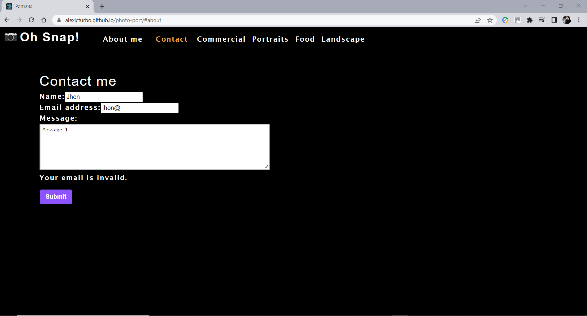
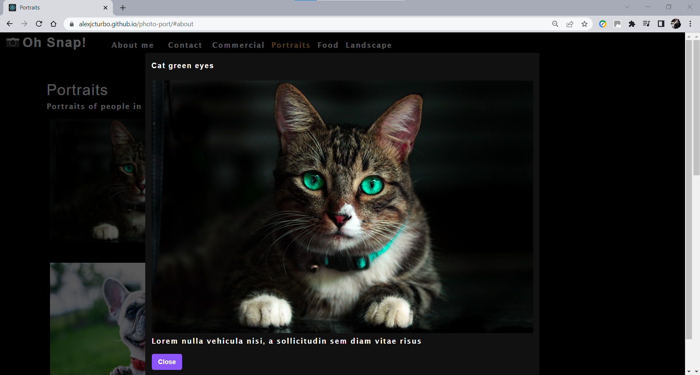

# Photo Portfolio

## Table of Contents

- [Project Description](#Project-Description)
- [User Story](#User-Story)
- [Screen Captures](#Screen-Captures)
- [Technologies](#Technologies)
- [Links](#Links)


## Project Description

This project is a single-page application (SPA) built with React. The project is a photography portfolio created using React state, props, Hooks, and reusable UI components to provide a simple yet sleek platform for showing off some photography skills. The page contains a header and a navigation section that includes the different sections of the SPA. The navigation title includes the sections "About me", "contact" and the categories of the photo gallery. Each section renders after the user selects the desired component without reloading the page. The different photo galleries display the photos. When the user clicks on any photo from the gallery, a modal displays the image in a large format. A "Close" button enables the function to close the modal and go back to the gallery without reloading the page.
###### [Back to Index](#Table-of-Contents)


## User Story

```
AS A developer
I WANT to create a single-page application (SPA) using React
SO THAT the page works without reloading every time a section is accessed and the photo gallery uses modals to display photos in large format.
```
###### [Back to Index](#Table-of-Contents)


## Screen Captures







###### [Back to Index](#Table-of-Contents)


## Technologies


###### [Back to Index](#Table-of-Contents)


## Links

- [Deployed Application](https://alexjcturbo.github.io/photo-port/)
- [GitHub Repository](https://github.com/AlexJCturbo/photo-port)

###### [Back to Index](#Table-of-Contents)